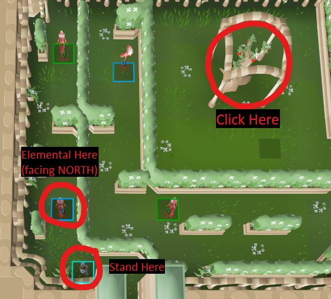

# One Click Sorceress' Summer Garden

The [Sorceress' Garden](https://oldschool.runescape.wiki/w/Sorceress%27s_Garden) 
is a minigame located in south-western Al Kharid 
useful for training thieving, or collecting herbs.
For the Summer Garden, there is a method 
for navigating the entire garden in a single click.
This plugin assists in that,
by showing which elementals need to be reset,
and how many times they need to be reset,
in order for the one-click method to work.

### Plugin Usage

To use this plugin, I recommend that you are already familiar with the one-click method.
You can find this method 
[on the OSRS Wiki here](https://oldschool.runescape.wiki/w/Sorceress%27s_Garden/Summer#One-click_Summer_Garden_Method).

For each elemental, it will be highlighted in one of four colours
(configurable through the settings panel):
* Green; the elemental does not require any resets
* Orange; the elemental requires the number of rests shown over it
* Blue; the elementals are on the correct cycle to perform the one-click
* Grey; not enough information has been gathered (wait a few seconds, or requires resetting the first or third elemental)

When an elemental is orange, you will need to navigate the maze far enough to reset it.
Some elementals may require multiple resets, 
and the number required will be rendered on the elemental.

Once all the elementals are green, 
you should position yourself just before the first elemental's path,
and wait until the first and third elementals turn blue.
These two elementals will turn blue 
when they collide against their inner walls simultaneously.
When the first elemental is highlighted blue,
and walks **NORTH** over the blue tile, 
click the Sq'irk tree.
Your character should run straight through the whole garden.

Here's an image showing when to click:

Although this may sound complex,
I promise you after a couple iterations you'll have it on lock.
